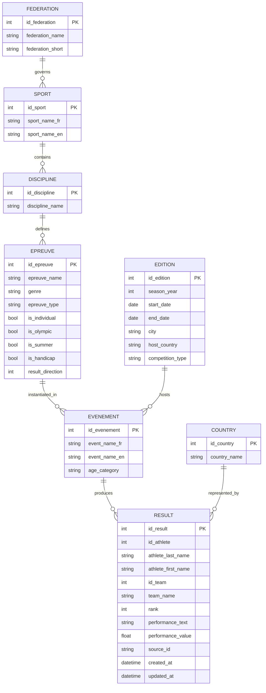

# MCD — Modèle Conceptuel de Données

Diagramme entité-association (MERISE) pour le projet Olympic Results.

## Entités et associations

## Cardinalités

| Association | Entité A | Card. | Entité B | Card. |
|---|---|---|---|---|
| governs | FEDERATION | 1,1 | SPORT | 0,N |
| contains | SPORT | 1,1 | DISCIPLINE | 0,N |
| defines | DISCIPLINE | 1,1 | EPREUVE | 0,N |
| instantiated_in | EPREUVE | 1,1 | EVENEMENT | 0,N |
| hosts | EDITION | 1,1 | EVENEMENT | 0,N |
| produces | EVENEMENT | 1,1 | RESULT | 0,N |
| represented_by | COUNTRY | 1,1 | RESULT | 0,N |
