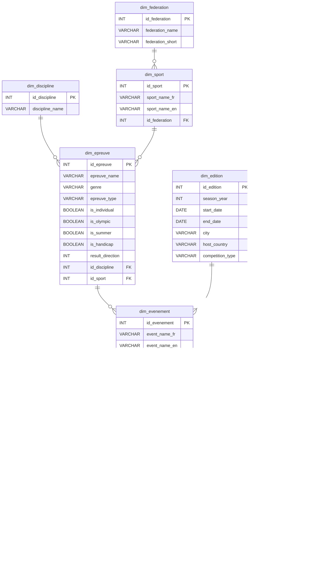

# MLD — Modèle Logique de Données

Transformation du MCD en schéma relationnel (3NF).

## Schéma relationnel

```
dim_country (id_country PK, country_name)

dim_federation (id_federation PK, federation_name, federation_short)

dim_sport (id_sport PK, sport_name_fr, sport_name_en, #id_federation FK→dim_federation)

dim_discipline (id_discipline PK, discipline_name)

dim_epreuve (id_epreuve PK, epreuve_name, genre, epreuve_type,
             is_individual, is_olympic, is_summer, is_handicap,
             result_direction, #id_discipline FK→dim_discipline,
             #id_sport FK→dim_sport)

dim_edition (id_edition PK, season_year, start_date, end_date,
             city, host_country, competition_type)

dim_evenement (id_evenement PK, event_name_fr, event_name_en,
               age_category, #id_epreuve FK→dim_epreuve, #id_edition FK→dim_edition)

fact_result (id_result PK, #id_evenement FK→dim_evenement, #id_country FK→dim_country,
             id_athlete, athlete_last_name, athlete_first_name,
             id_team, team_name, rank, performance_text, performance_value,
             source_id, created_at, updated_at)
```

## Diagramme MLD



## Règles de passage MCD → MLD

1. Chaque entité → une table relationnelle.
2. L'identifiant de chaque entité → clé primaire (PK).
3. Associations (1,N) : la clé primaire du côté "1" migre comme FK dans la table du côté "N".
4. Pas d'association N:N dans ce modèle → pas de table associative nécessaire.
5. Attributs optionnels (athlete, team) : NULLable dans `fact_result` car certains résultats sont collectifs sans athlète nommé.
