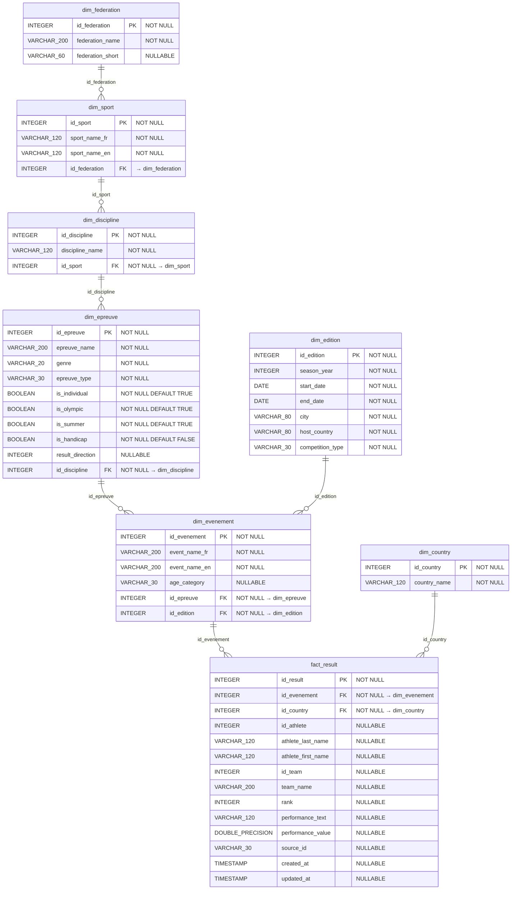

# MPD — Modèle Physique de Données

Implémentation du MLD sur PostgreSQL 15.

## Choix du SGBD

**PostgreSQL 15** : base relationnelle open-source, robuste, conforme SQL:2016,
support natif des types DATE, BOOLEAN, DOUBLE PRECISION et indexation B-tree.
Déjà utilisée dans le projet pour le stockage et Airflow.

## Spécifications physiques

| Table | Lignes estimées | Taille estimée |
|---|---|---|
| dim_country | 212 | < 1 KB |
| dim_federation | 37 | < 1 KB |
| dim_sport | 66 | < 1 KB |
| dim_discipline | 75 | < 1 KB |
| dim_epreuve | 529 | ~30 KB |
| dim_edition | 170 | ~10 KB |
| dim_evenement | 1 185 | ~100 KB |
| fact_result | 35 690 | ~5 MB |

## Index

- Toutes les clés primaires (PK) disposent d'un index unique automatique.
- Index supplémentaires B-tree sur les clés étrangères de `fact_result`
  (`id_evenement`, `id_country`, `id_athlete`) pour accélérer les JOIN.
- Index sur les FK dans `dim_sport`, `dim_discipline`, `dim_epreuve`, `dim_evenement`.

## Script DDL

Voir [`sql/init_target_db.sql`](../sql/init_target_db.sql).

## Diagramme physique

